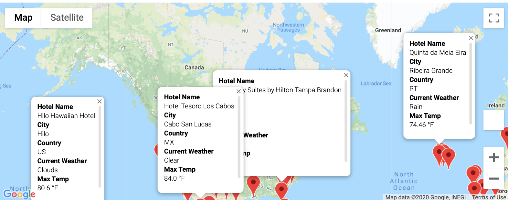
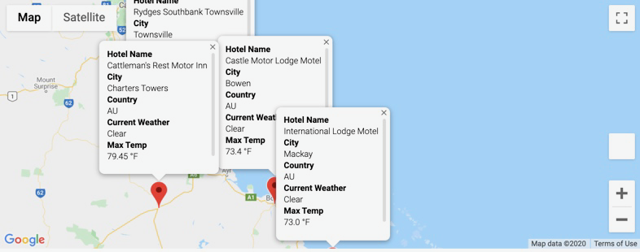

# World_Weather_Analysis
Three analyses included in this repository include:
- Weather_Database: The included code will generate 2,000 random latitudes and 2,000 random longitutes to create 2,000 random coordinates. Eliminating coordinates that are not close to a city, the end result will be a list of hundreds of cities around the world. Those cities are collected into a DataFrame and the random sampling run was used to create a CSV file (WeatherPy_Database) for use in next analysis.

- Vacation_Search: Using the Weather_Py Database, the user is prompted to set a minimum and maximum temperature for their next vacation. Using this criteria and applying it to the DataFrame created from CSV file, along with use of GoogleMaps parameters to identify hotels within 5,000 meters of each target city. Cities not within the target temperature or without a hotel listed with GoogleMaps were removed from the DataFrame. Remaining destinations were then added to a GoogleMaps marker layer to allow the user to visualize potential hotel/city destinations around the world and click on a given mark to view details including hotel name, city, country, current weather, and maximum temperature. 

The DataFrame list of hotels meeting the criteria was also written to a CSV file (WeatherPy_Vacation) for use in next step.

- Finally, the larger DataFrame of hotels meeting the defined criteria was narrowed to consider a trip including four destination cities one could travel between and create a potential itinerary. Of the hotels included, four hotels were identified in Australia's Queensland district. The four destinations were mapped for a potential itinerary using Google Directions API to include details for each destination contained in the marker.

